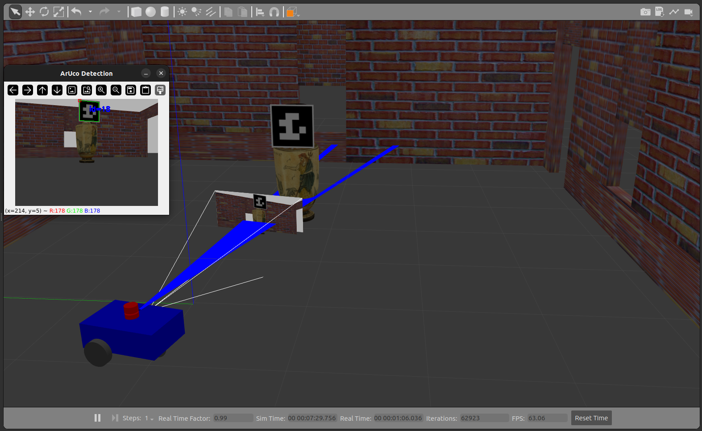

# Object detection


<p style="text-align: justify;">
With the aid of a visual marker and the `RANSAC` method, the robot is able to detect and localize the target object in its environment. Once the object’s position is estimated, the robot autonomously navigates toward it, continuously refining its trajectory based on the detected marker. When it reaches the predefined distance set by the user, the robot stops and maintains a stable position, ensuring accurate alignment with the object for subsequent tasks such as inspection or image acquisition.
</p>

### Steps

<p style="text-align: justify;">
Inside the folder `my_robot_description`, open two terminal windows.
In the first terminal, execute the following commands:
</p>
```
source install/setup.bash
```
after

```
ros2 launch my_robot_bringup my_robot_gazebo.launch.xml 
```

Then, in the second terminal, run:

```
source install/setup.bash
```
after

```
ros2 run robot_controller qr
```
or 

```
ros2 run robot_controller marker_kalo
```
<p align="center">
  
  
</p>


### RANSAC-3D and marker-based detection 

<p style="text-align: justify;">
Inside the folder `my_robot_description`, open two terminal windows.
In the first terminal, execute the following commands:
</p>

<p align="center">
    
</p>

```
source install/setup.bash
```
after

```
ros2 launch my_robot_bringup my_robot_gazebo.launch.xml 
```

Then, in the second terminal, run:

```
source install/setup.bash
```
after

```
ros2 run robot_controller ransac
```

<p align="center">
  <video width="700" controls>
    <source src="../../assets/3.mp4" type="video/mp4">
    Your browser does not support the video tag.
  </video>
</p>
