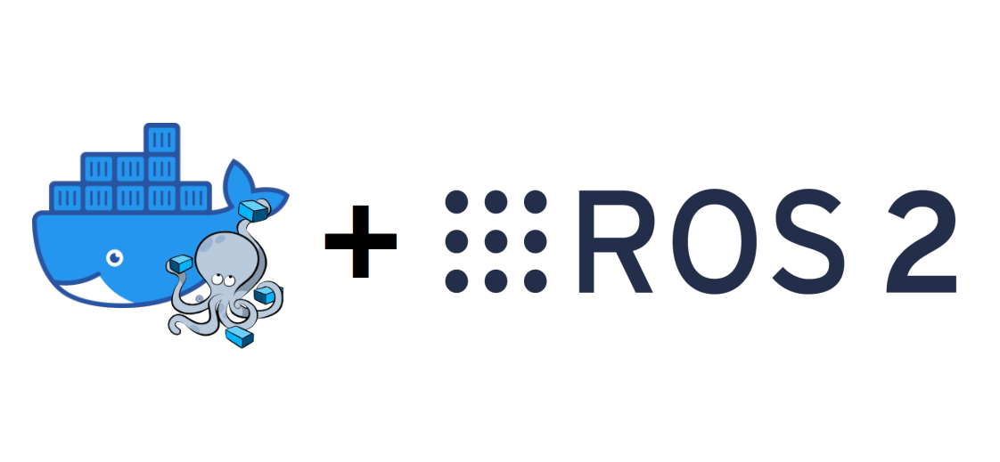
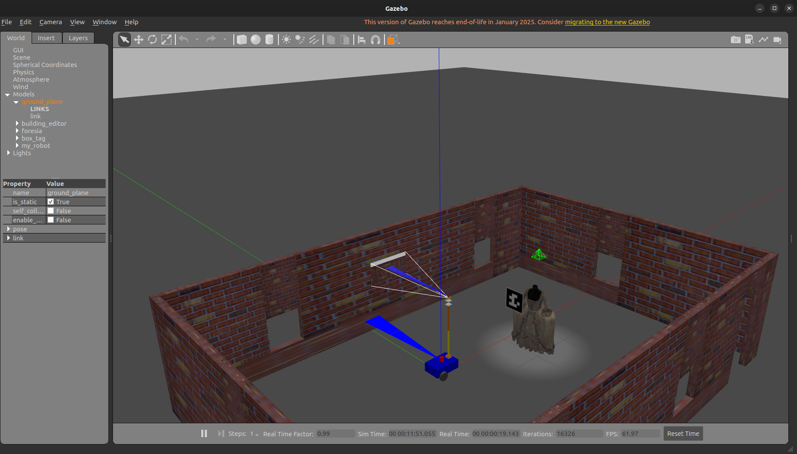

## Basic Installation

### Step 1
<p style="text-align: justify;">
The first step is to install ROS 2.
This can be done inside a Docker container, providing an isolated and reproducible environment for development.
</p>

<p align="center">
    <a href = "https://github.com/SakshayMahna/ros2env" target="_blank">
        
    </a>
</p>

### Step 2
<p style="text-align: justify;">
Download a copy of the robotic system package from [GitHub](https://github.com/TEXTaiLES/Robotics/tree/main/my_robot_description) or get the zip archive.
If you’re not familiar with git, don’t worry — just download the zip file and extract it somewhere on your computer.
However, the best approach is to git clone the repository, as this allows you to periodically update your installation without affecting your custom configurations.
</p>

To clone the repository using the terminal, run:
```
git clone https://github.com/TEXTaiLES/Robotics.git
``` 

### Step 3
<p style="text-align: justify;">
After the installation is complete, navigate to the `my_robot_description` folder, and inside it, execute the following commands:
</p>

```
colcon build
colcon build --symlink-install
```


### Step 4
To enable image processing capabilities, install OpenCV and the ROS 2 bridge package by running the following commands in the terminal:

```
pip install opencv-python
```
then
```
sudo apt install ros-humble-cv-bridge
```

<p align="center">
      <a href = "https://opencv.org/" target="_blank">
        
      </a>
</p>


### Step 5
<p style="text-align: justify;">
Inside the `my_robot_description` directory, source the workspace by running:
</p>

```
source install/setup.bash
```

<p style="text-align: justify;">
Then, launch the simulation with:
</p>
```
ros2 launch my_robot_bringup my_robot_gazebo.launch.xml
```
<p style="text-align: justify;">
This will start Gazebo and load the robot into its virtual environment.
</p>
<p align="center">
        
</p>
